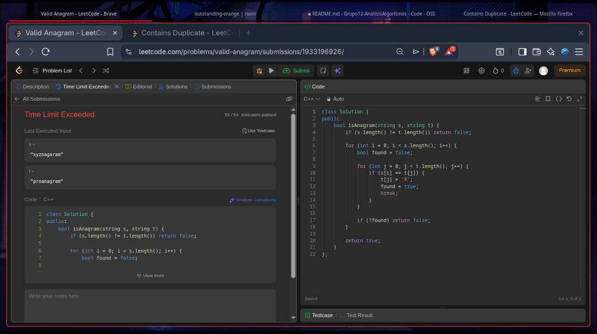
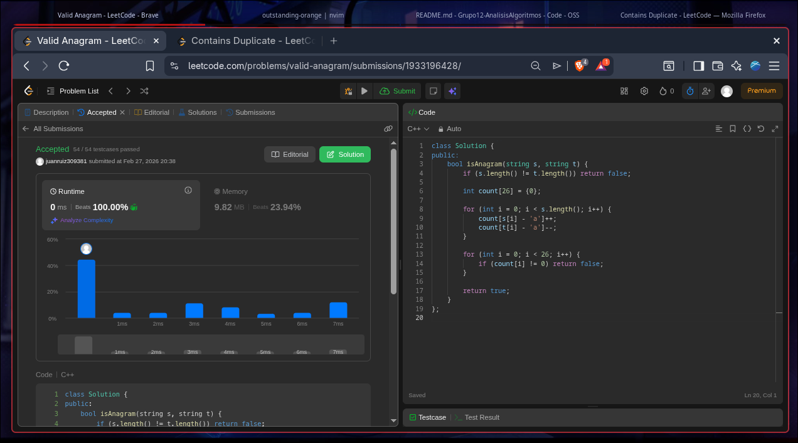
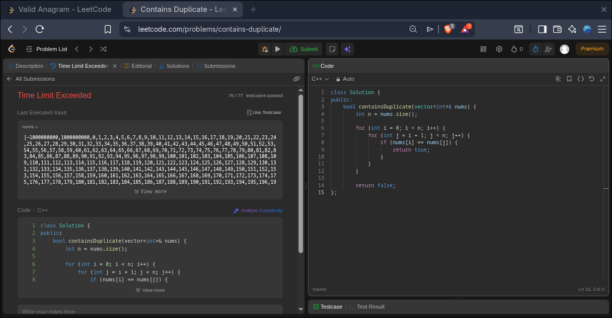

## Aqui ira el contenido del parcial 1
## Punto 1
Solución fuerza bruta:


```cpp
class Solution {
public:
    bool isAnagram(string s, string t) {
        if (s.length() != t.length()) return false;

        for (int i = 0; i < s.length(); i++) {
            bool found = false;

            for (int j = 0; j < t.length(); j++) {
                if (s[i] == t[j]) {
                    t[j] = '#'; 
                    found = true;
                    break;
                }
            }

            if (!found) return false;
        }

        return true;
    }
};
```
Solución optimizada:


```cpp
codigo:
class Solution {
public:
    bool isAnagram(string s, string t) {
        if (s.length() != t.length()) return false;

        int count[26] = {0};

        for (int i = 0; i < s.length(); i++) {
            count[s[i] - 'a']++;
            count[t[i] - 'a']--;
        }

        for (int i = 0; i < 26; i++) {
            if (count[i] != 0) return false;
        }

        return true;
    }
};
```

## Punto 2
Solución fuerza bruta:


```cpp
class Solution {
public:
    bool containsDuplicate(vector<int>& nums) {
        int n = nums.size();

        for (int i = 0; i < n; i++) {
            for (int j = i + 1; j < n; j++) {
                if (nums[i] == nums[j]) {
                    return true;
                }
            }
        }

        return false;
};
```

Solución optimizada:


```cpp
class Solution {
public:
    bool containsDuplicate(vector<int>& nums) {
        unordered_set<int> seen;

        for (int num : nums) {
            if (seen.find(num) != seen.end()) {
                return true;
            }
            seen.insert(num);
        }

        return false; 
    }
};
