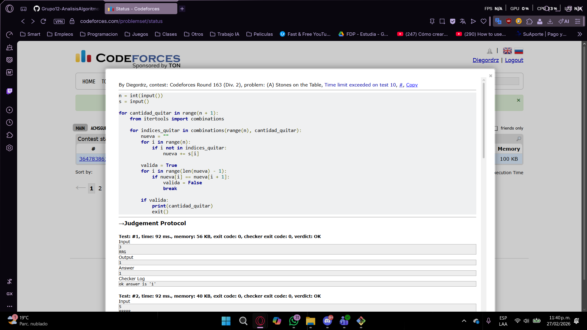

## Ejercicios 4
Solución fuerza bruta:


```cpp
n = int(input())
s = input()
 
for cantidad_quitar in range(n + 1):
    from itertools import combinations
    
    for indices_quitar in combinations(range(n), cantidad_quitar):
        nueva = ""
        for i in range(n):
            if i not in indices_quitar:
                nueva += s[i]
        
        valida = True
        for i in range(len(nueva) - 1):
            if nueva[i] == nueva[i + 1]:
                valida = False
                break
        
        if valida:
            print(cantidad_quitar)
            exit()
```
Solución optimizada:


```cpp
n = int(input())
s = input()

contador = 0

for i in range(n - 1):
    if s[i] == s[i + 1]:
        contador += 1

print(contador)
```
