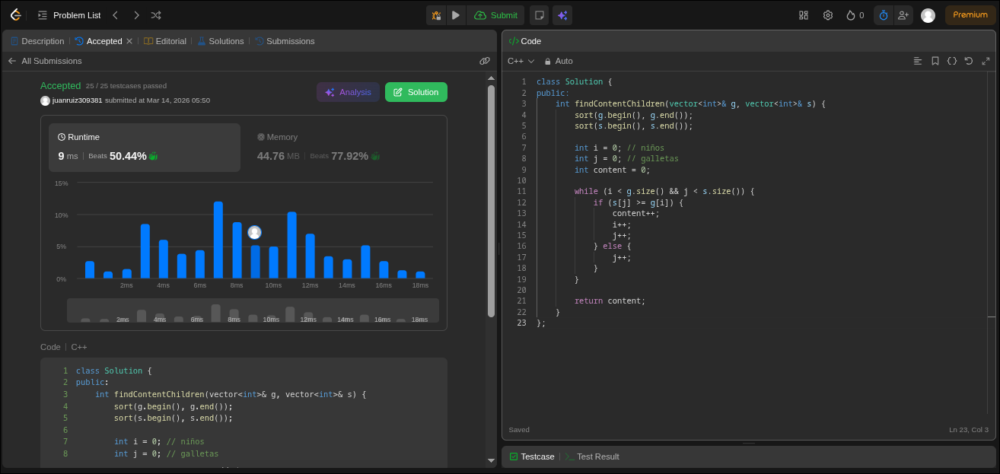
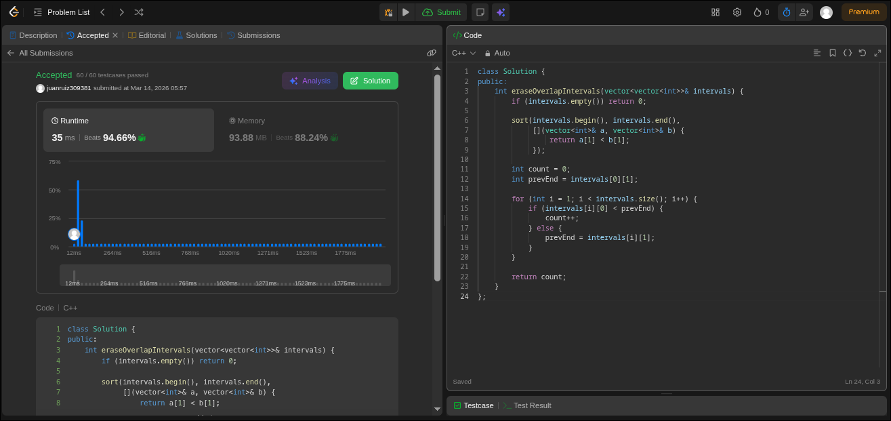

## Ejercicios 1 y 2 
## Punto 1

Solución:


```cpp
codigo:
class Solution {
public:
    int findContentChildren(vector<int>& g, vector<int>& s) {
        sort(g.begin(), g.end());
        sort(s.begin(), s.end());

        int i = 0; // niños
        int j = 0; // galletas
        int content = 0;

        while (i < g.size() && j < s.size()) {
            if (s[j] >= g[i]) {
                content++;
                i++;
                j++;
            } else {
                j++;
            }
        }

        return content;
    }
};
```

# Estrategia Greedy

La idea es **asignar primero las galletas más pequeñas posibles a los niños menos exigentes**.

# Justificación del enfoque Greedy

Ordenar ambos arreglos permite aplicar una estrategia óptima:

Se intenta satisfacer primero a los niños menos exigentes.

A cada niño se le asigna la galleta más pequeña que lo satisfaga.

Esto es correcto porque:

Si se le diera una galleta grande a un niño poco exigente, se podría desperdiciar una galleta que podría necesitar un niño más exigente.

Al usar la galleta mínima posible para cada niño, se preservan las galletas grandes para quienes realmente las necesitan.

Por lo tanto, esta decisión local (asignar la galleta mínima válida) no perjudica la solución global, cumpliendo la propiedad greedy.

## Complejidad

### Tiempo
Sea:

- n = número de niños
- m = número de galletas
Entonces:

- Ordenar niños: `O(n log n)`
- Ordenar galletas: `O(m log m)`
- Recorrido con dos punteros: `O(n + m)`

**Complejidad total:**
O(n log n + m log m)

### Espacio
O(1)

*(sin contar el espacio utilizado por el algoritmo de ordenamiento).*


## Punto 2

Solución:

```cpp
class Solution {
public:
    int eraseOverlapIntervals(vector<vector<int>>& intervals) {
        if (intervals.empty()) return 0;

        sort(intervals.begin(), intervals.end(), 
             [](vector<int>& a, vector<int>& b) {
                 return a[1] < b[1];
             });

        int count = 0;
        int prevEnd = intervals[0][1];

        for (int i = 1; i < intervals.size(); i++) {
            if (intervals[i][0] < prevEnd) {
                count++;
            } else {
                prevEnd = intervals[i][1];
            }
        }

        return count;
    }
};
```

## Justificación Greedy

Ordenar por **menor tiempo de finalización (`end`)** permite escoger siempre el intervalo que deja **más espacio disponible** para los siguientes.

Cuando aparece un solapamiento, eliminar el intervalo que **termina más tarde** garantiza que el conjunto restante tenga mayor posibilidad de acomodar más intervalos sin generar conflictos.

Este enfoque sigue el mismo principio del problema clásico **Activity Selection**, donde elegir la actividad que termina primero maximiza el número de actividades compatibles.

---

## Complejidad
Sea n el número de intervalos.

### Tiempo

- Ordenar intervalos: `O(n log n)`
- Recorrido del arreglo: `O(n)`

**Complejidad total:**
O(n log n)

### Espacio
O(1)
