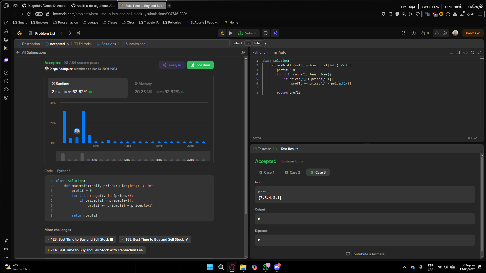
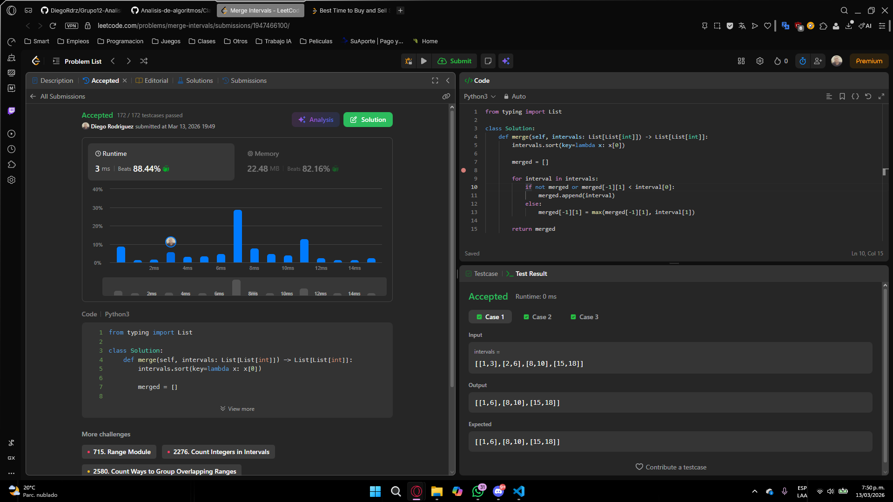

# Punto 4
## 1. Solucion


```python
class Solution:
    def maxProfit(self, prices: List[int]) -> int:
        profit = 0
        for i in range(1, len(prices)):
            if prices[i] > prices[i-1]:
                profit += prices[i] - prices[i-1]

        return profit
```

---

## 2. Estrategia Greedy

La estrategia voraz consiste en aprovechar cada incremento de precio entre días consecutivos.

Criterio greedy utilizado:

* Si el precio del día actual es mayor que el del día anterior, se toma esa ganancia.

Esto equivale a:

* comprar en el día `i-1`
* vender en el día `i`

De esta manera el algoritmo captura todas las subidas del precio acumulando sus ganancias.

---

## 3. Justificación

Si existe una secuencia de precios creciente, por ejemplo:

- 1 → 3 → 5

Hay dos maneras de operar:

**Opción 1 (una sola operación)**

- comprar en 1
- vender en 5
- ganancia = 4

**Opción 2 (estrategia greedy)**

- comprar en 1, vender en 3 → ganancia = 2
- comprar en 3, vender en 5 → ganancia = 2
- ganancia total = 4

Ambas producen la misma ganancia total.

Por lo tanto, dividir las subidas en incrementos consecutivos no reduce el beneficio y permite capturar todas las oportunidades de ganancia.

Esto demuestra que la estrategia greedy produce la solución óptima.

---

## 4. Complejidad

### Complejidad temporal

El algoritmo recorre el arreglo de precios una sola vez.

- O(n)

donde `n` es el número de días.

---

### Complejidad espacial

Solo se utilizan variables auxiliares (`profit` e índice).

- O(1)

Esto significa que el espacio adicional utilizado es constante.


# Punto 5
## 1. Solucion


```python
from typing import List

class Solution:
    def merge(self, intervals: List[List[int]]) -> List[List[int]]:
        intervals.sort(key=lambda x: x[0])

        merged = []

        for interval in intervals:
            if not merged or merged[-1][1] < interval[0]:
                merged.append(interval)
            else:
                merged[-1][1] = max(merged[-1][1], interval[1])

        return merged
```

---

## 2. Estrategia Greedy

La estrategia greedy consiste en:

1. Ordenar los intervalos por su punto de inicio.
2. Recorrerlos en orden.
3. Mantener una lista de intervalos fusionados.
4. Para cada intervalo:

   * Si no se superpone con el último intervalo agregado, se añade.
   * Si se superpone, se fusiona extendiendo el final del último intervalo.

Regla greedy utilizada:

- Siempre fusionar inmediatamente los intervalos que se superponen con el último intervalo construido.

Esto permite resolver el problema tomando decisiones locales óptimas en cada paso.

---

## 3. Justificación

Al ordenar los intervalos por su punto de inicio, cualquier intervalo que pueda superponerse con otro aparecerá después de él en la lista.

Por lo tanto, al recorrer los intervalos en orden:

* Solo es necesario comparar el intervalo actual con el último intervalo ya fusionado.
* Si existe superposición, extender el final del intervalo actual garantiza cubrir completamente ambos intervalos.
* Si no hay superposición, significa que ningún intervalo anterior puede solaparse con el actual.

Esta propiedad asegura que cada decisión local de fusionar intervalos produce una solución correcta y completa.

---

## 4. Complejidad

### Complejidad temporal

El costo principal proviene de ordenar los intervalos.

- O(n log n)

donde `n` es el número de intervalos.

El recorrido posterior del arreglo es lineal:

- O(n)

Por lo tanto, la complejidad total es:

- O(n log n)

---

### Complejidad espacial

Se utiliza una lista adicional para almacenar los intervalos fusionados.

- O(n)

en el peor caso, cuando ningún intervalo se superpone.

