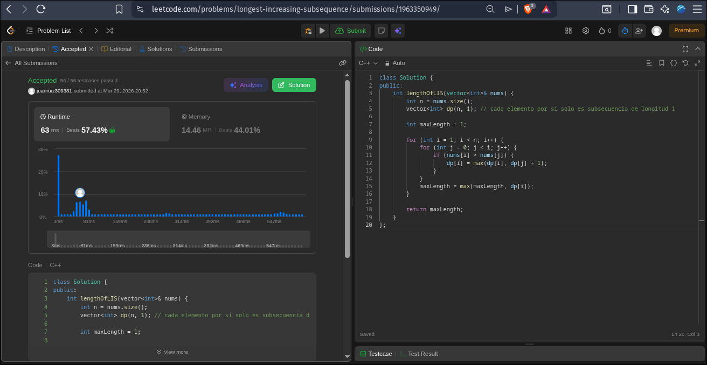
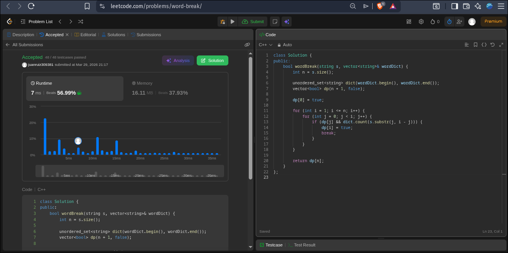

## Ejercicios 1 y 2 
## Punto 1

### Solución:


```cpp
codigo:
class Solution {
public:
    int lengthOfLIS(vector<int>& nums) {
        int n = nums.size();
        vector<int> dp(n, 1);

        int maxLength = 1;

        for (int i = 1; i < n; i++) {
            for (int j = 0; j < i; j++) {
                if (nums[i] > nums[j]) {
                    dp[i] = max(dp[i], dp[j] + 1);
                }
            }
            maxLength = max(maxLength, dp[i]);
        }

        return maxLength;
    }
};
```

## 2. Estrategia de Programación Dinámica

Se construye un arreglo dp de tamaño n, donde:

* dp[i] representa la longitud de la subsecuencia estrictamente creciente más larga que termina en el índice i.

### Casos base

* Cada elemento por sí solo es una subsecuencia creciente:
dp[i] = 1

### Recurrencia utilizada

Para cada posición i, se revisan todas las posiciones anteriores j < i:

Si nums[i] > nums[j], entonces se puede extender la subsecuencia:
dp[i] = max(dp[i], dp[j] + 1)

### Respuesta final
max(dp[i]) para todo i en [0, n-1]

---

## 3. Justificación

El enfoque es correcto porque:

* Se descompone el problema en subproblemas:
    *  ¿Cuál es la mejor subsecuencia que termina en cada índice?
* Para cada i, se consideran todas las formas válidas de llegar a él desde posiciones anteriores.

### Por qué funciona la recurrencia
* Si nums[i] > nums[j], entonces:
    * La subsecuencia que termina en j puede extenderse con nums[i].
* Se toma el máximo porque queremos la subsecuencia más larga posible.

### Optimalidad
* Cada subproblema dp[i] se calcula usando resultados óptimos previos.
* Se evalúan todas las posibilidades válidas → garantiza solución global óptima.

---

## 4. Complejidad

**Complejidad temporal**

Dos ciclos anidados:

* O(n²)

donde n es el tamaño del arreglo.

**Complejidad espacial**

Se usa un arreglo dp de tamaño n:

* O(n)


## Punto 2

### Solución:

```cpp
class Solution {
public:
    bool wordBreak(string s, vector<string>& wordDict) {
        int n = s.size();
        
        unordered_set<string> dict(wordDict.begin(), wordDict.end());
        vector<bool> dp(n + 1, false);
        
        dp[0] = true; 
        
        for (int i = 1; i <= n; i++) {
            for (int j = 0; j < i; j++) {
                if (dp[j] && dict.count(s.substr(j, i - j))) {
                    dp[i] = true;
                    break;
                }
            }
        }
        
        return dp[n];
    }
};

```
## 2. Estrategia de Programación Dinámica

Se construye un arreglo dp de tamaño n+1, donde:

* dp[i] indica si el prefijo s[0...i-1] puede segmentarse en palabras del diccionario.

### Casos base

dp[0] = true;
* La cadena vacía siempre es válida.

### Recurrencia utilizada

Para cada posición i, se evalúan todos los cortes posibles j < i:

    if (dp[j] && s.substr(j, i - j) ∈ wordDict)
    dp[i] = true;

### Respuesta final
dp[n]

---

## 3. Justificación

El enfoque es correcto porque:

* Se divide el problema en subproblemas:
    * ¿Se puede segmentar cada prefijo de la cadena?

### Por qué funciona la recurrencia
* Si dp[j] es verdadero:
    * Significa que s[0...j-1] es segmentable.
* Si además s[j...i-1] está en el diccionario:
    * Entonces s[0...i-1] también es segmentable.

**Uso de** unordered_set

Permite verificar si una palabra existe en el diccionario en:

    O(1) promedio

### Optimalidad
* Cada subproblema dp[i] se calcula una sola vez.
* Se exploran todas las particiones posibles → garantiza solución correcta global.

---

## 4. Complejidad

**Complejidad temporal**

* Dos ciclos anidados:

    O(n²)

* Más el costo de substr (hasta O(n)):

    O(n³) en el peor caso

**Complejidad espacial**

* Arreglo dp:

    O(n)

* Estructura del diccionario:
    
    O(m)

donde m es el tamaño de wordDict.
