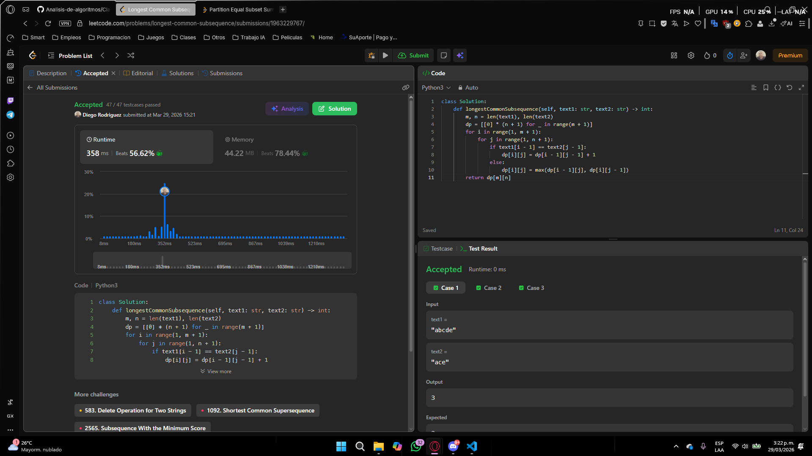
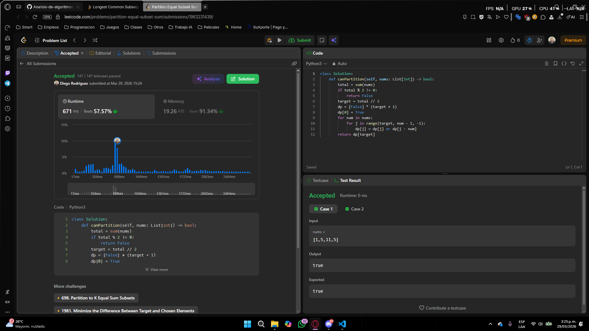

# Punto 4

## 1. Solución


```python
class Solution:
    def longestCommonSubsequence(self, text1: str, text2: str) -> int:
        m, n = len(text1), len(text2)
        dp = [[0] * (n + 1) for _ in range(m + 1)]
        for i in range(1, m + 1):
            for j in range(1, n + 1):
                if text1[i - 1] == text2[j - 1]:
                    dp[i][j] = dp[i - 1][j - 1] + 1
                else:
                    dp[i][j] = max(dp[i - 1][j], dp[i][j - 1])
        return dp[m][n]
```

---

## 2. Estrategia de Programación Dinámica

Se construye una tabla dp de dimensiones (m+1) x (n+1) donde dp[i][j] representa la longitud de la subsecuencia común más larga entre los primeros i caracteres de text1 y los primeros j caracteres de text2.

Recurrencia utilizada:

* Si text1[i-1] == text2[j-1], entonces dp[i][j] = dp[i-1][j-1] + 1
* Si no, dp[i][j] = max(dp[i-1][j], dp[i][j-1])

La respuesta final se encuentra en dp[m][n].

---

## 3. Justificación

Los casos base dp[0][j] = 0 y dp[i][0] = 0 representan que comparar cualquier cadena contra una cadena vacía produce una LCS de longitud 0.

La recurrencia es correcta porque:

* Cuando dos caracteres coinciden, necesariamente forman parte de la LCS óptima y se extiende la solución del subproblema anterior.
* Cuando no coinciden, la LCS no puede incluir ambos caracteres al mismo tiempo, por lo que se toma el mejor resultado omitiendo uno u otro.

Dado que cada subproblema dp[i][j] se calcula una sola vez y en orden, el algoritmo garantiza la solución óptima global.

---

## 4. Complejidad

**Complejidad temporal**

Se llena cada celda de la tabla con operaciones O(1).

* O(m × n)

donde m y n son las longitudes de text1 y text2.

**Complejidad espacial**

Se almacena la tabla completa de dimensiones (m+1) x (n+1).

* O(m × n)

# Punto 5

## 1. Solución


```python
class Solution:
    def canPartition(self, nums: List[int]) -> bool:
        total = sum(nums)
        if total % 2 != 0:
            return False
        target = total // 2
        dp = [False] * (target + 1)
        dp[0] = True
        for num in nums:
            for j in range(target, num - 1, -1):
                dp[j] = dp[j] or dp[j - num]
        return dp[target]
```

---

## 2. Estrategia de Programación Dinámica

Se reduce el problema a verificar si existe un subconjunto de nums cuya suma sea exactamente total // 2.

Se usa un arreglo dp de tamaño target + 1 donde dp[j] indica si es posible formar la suma j con los elementos procesados hasta el momento.

Recurrencia utilizada:

* dp[j] = dp[j] or dp[j - num] para cada número num en nums

El recorrido de j se hace de mayor a menor para evitar usar el mismo elemento más de una vez.

---

## 3. Justificación

El caso base dp[0] = True representa que la suma 0 siempre es alcanzable con un subconjunto vacío.

La recurrencia es correcta porque:

* dp[j - num] indica si era posible formar la suma j - num antes de considerar num. Si sí, entonces añadiendo num se puede formar j.
* Recorrer j de derecha a izquierda garantiza que cada elemento se usa a lo sumo una vez, lo que corresponde al problema de la mochila 0/1.

Si al final dp[target] es True, existe un subconjunto con suma target, y el resto del arreglo también suma target, por lo que la partición es válida.

---

## 4. Complejidad

**Complejidad temporal**

Para cada elemento del arreglo se recorre el arreglo dp de tamaño target.

* O(n × target)

donde n es el número de elementos y target = sum(nums) // 2.

**Complejidad espacial**

Se utiliza un arreglo auxiliar de tamaño target + 1.

* O(target)